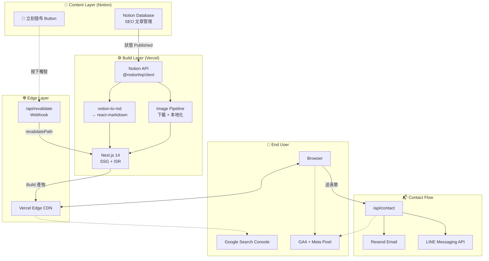
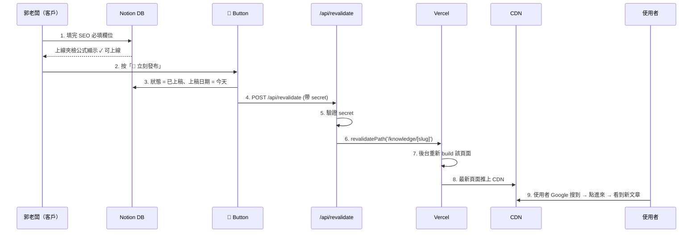
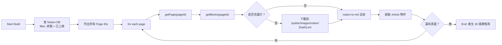
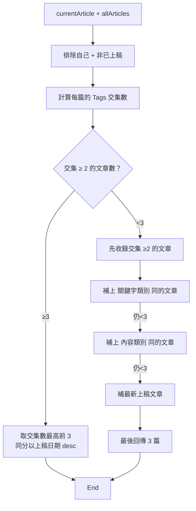
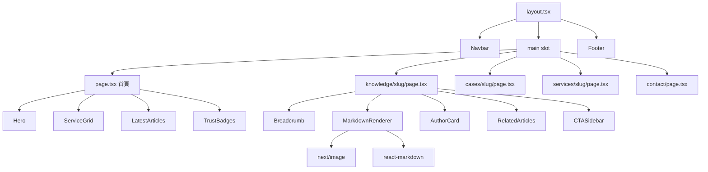
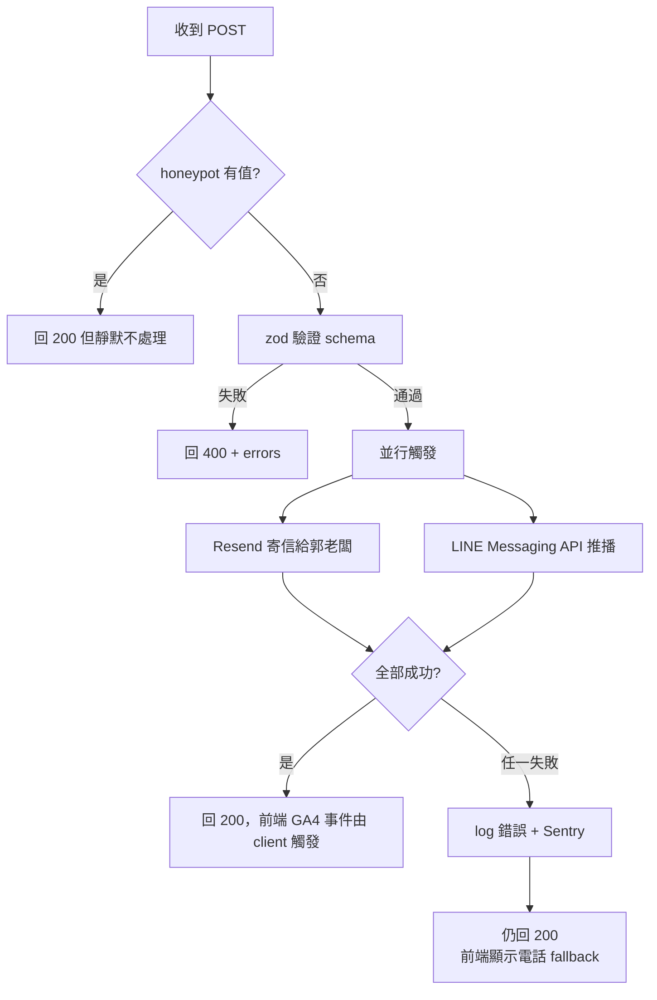

# 金智消防官網｜SPEC.md（PRD + SDD + TDD 合併匯出版）

> **文件性質：** Claude Code 開工專用 SPEC v1.1（PRD + SDD + TDD 合併版）
>
> **使用方式：** Notion 右上角 `⋯` → Export → Markdown & CSV → 下載 → 解壓出 `.md` → 改名為 `SPEC.md` → 放進專案 `docs/` 資料夾
>
> **Claude Code 指令範本：** 「請先讀 `docs/SPEC.md`，建立完整專案背景圖，從 Part C 的 T01 開始執行，每完成一張任務卡就停下來等我檢核 Checklist。」

---

## 📖 如何使用這份文件？（Claude Code 開工手冊）

這份 SPEC 把整個專案的三層思考合併在一起：**做什麼（PRD）→ 怎麼設計（SDD）→ 怎麼實作（TDD）**。讀的順序也請按這個方向：先把 Part A 建立商業背景，再看 Part B 理解模組切法與資料流，最後按 Part C 一張張任務卡執行。

### 建議資料夾結構

```bash
kingzhi-web/
├── docs/
│   └── SPEC.md                # ← 這份文件
├── app/
├── components/
├── lib/
├── public/
│   └── images/notion/         # Build time 下載的 Notion 圖
├── .env.local                 # 見 Part C / T01
├── .env.local.example
├── next.config.js
└── package.json
```

### 開工 SOP

| **階段** | **動作** | **檢核** |
| --- | --- | --- |
| 1 | 讀完整份 SPEC，先回答 Part B §10 的 Open Questions Q1–Q9 | 全部填完再進 T01 |
| 2 | 從 Part C / T01 開始，一次只做一張任務卡 | 每張卡結尾 Checklist 全綠再進下一張 |
| 3 | 交稿前跑完 T13 全面驗收表 | AC-1 至 AC-18 全勾 |
| 4 | 部署完回報 Part B §10 的 Open Questions 給客戶郭老闆確認 | 9 條 Q 全部有答案或留檔交代 |

### 絕對不能踩的三個雷

| **雷** | **規範所在** |
| --- | --- |
| Notion S3 簽名 URL 被輸出到 HTML（1 小時後全站圖全壞） | Part B §3-3、Part C / T03 |
| 作者欄位標「消防設備師證照加持」（客戶定位是消防工程廠商，不是設備師） | Part A §6-2、Part C / T06 |
| API 撈料不帶 `狀態 = 已上稿` 過濾（草稿外洩） | Part A §2、Part C / T02、AC-16 |

---

# Part A｜PRD（產品需求）

> **客戶：** 智廷工程行（金智消防），負責人 **郭金智**（以下稱郭老闆）
>
> **公司登記：** 統編 92528634｜基隆市安樂區基金一路 135 巷 40 號 3 樓｜2023-03-16 設立｜獨資
>
> **⚠️ 年資定位：** 公司 2023 年設立，但郭老闆**個人有 20+ 年消防工程實戰**。全站文案必須明確切開「公司設立日」與「個人年資」，避免虛偽表示（公平交易法風險）。範例：「智廷工程行（2023 設立）・負責人郭金智 20+ 年消防工程實戰經驗」。
>
> **交付目標：** 約 14 小時內完成官網上線，承接 30 篇 SEO 文章
>
> **上線目標日：** 2026-04-30

## A-1. OVERVIEW

**System Name：** 金智消防官網（KingZhi Fire Safety Website）

**Purpose：** 用 Headless CMS 架構 + 30 篇 SEO 文章，承金智消防在 Google「基隆消防安檢」「北北基消防檢修申報」等關鍵字接單，同時建立 B2B 信任感，讓業主與社區管委會或主委主動來電詢價。

**Tech Stack：** Next.js 14 App Router + Tailwind CSS + Notion Headless CMS + Vercel（Hobby）

**Auth：** 不做。網站純對外行銷，後台內容管理交給 Notion。

**Data Source：** Notion Database「SEO 文章管理」。

## A-2. DATA MODEL（Notion CMS）

### A-2-1 Schema（對映 Notion 欄位）

```ts
interface NotionArticle {
  // 核心內容
  文章標題: string              // Title → H1
  Slug: string                  // URL 後綴，例 fire-inspection-guide
  內容類別: '📝 部落格文章' | '🔧 案例／實戰' | '🛠 服務頁'
  關鍵字類別: '🔴 商業搜尋詞' | '🟡 痛點／流程詞' | '🟠 檢修申報詞' | '🔵 地區詞'
  目標客群: '🟢 業主／店家' | '🏠 社區管委會／主委'
  目標關鍵字: string
  字數: number

  // SEO 欄位
  'SEO Title': string           // <title>，≤ 60 字元
  'SEO Description': string     // <meta description>，≤ 160 字元
  封面圖: File[]               // og:image，1200×630

  // 信任訊號（E-E-A-T）
  作者: string                  // 「郭金智｜智廷工程行負責人｜20+ 年消防工程實戰經驗」
  上稿日期: Date                // Schema datePublished
  最後更新: Date                // 讀 last_edited_time → Schema dateModified

  // 內部連結與分類
  Tags: string[]
  支柱文章: Relation            // 自關聯，limit 1，Topic Cluster 核心

  // 狀態控制
  狀態: '待撰寫' | '撰寫中' | '草稿' | '待審' | '已上稿'   // Notion Status 型別
  上線夾檢: string              // Formula，自動產生
}
```

> ⚠️ **T02 實作注意：** Notion 的「狀態」欄位型別必須是 **Status**（不是 Select）。Notion API 查詢語法兩者不同：Status 用 `status: { equals: '已上稿' }`，Select 用 `select: { equals: '已上稿' }`。進 T02 前請在 Notion DB 點「狀態」欄位確認型別。

### A-2-2 URL 路由對映

```js
RULE: Slug 結合內容類別產生路由
  IF 內容類別 = '📝 部落格文章'   THEN URL = /knowledge/[slug]
  IF 內容類別 = '🔧 案例／實戰'   THEN URL = /cases/[slug]
  IF 內容類別 = '🛠 服務頁'       THEN URL = /services/[slug]
```

### A-2-3 Topic Cluster 集群連結邏輯

```js
RULE: 支柱文章主題中心
  Step 1: 支柱文章 A 底部 → 反向查詢所有 支柱文章 = A 的群集文章列表
  Step 2: 群集文章頁首 → 顯示「⬆ 回到支柱文章：[標題]」的連結
  Step 3: /knowledge 總覽 → 按 關鍵字類別 分四個 Topic Cluster 入口
```

## A-3. PAGES & ROUTES

| **Route** | **Page** | **Description** |
| --- | --- | --- |
| `/` | 首頁 | Hero + 三大服務 + 最新文章 + 信任訊號 |
| `/services` | 服務總覽 | 三大服務分類卡片 |
| `/services/[slug]` | 服務詳情 | 單一服務頁（Notion 驅動） |
| `/knowledge` | 知識庫總覽 | 四大 Topic Cluster 入口 |
| `/knowledge/[slug]` | 知識文章詳情 | SEO 核心頁 |
| `/cases` | 案例總覽 | 實戰案例清單 |
| `/cases/[slug]` | 案例詳情 | 案例頁（Notion 驅動） |
| `/contact` | 聯絡我們 | 表單 + 電話一鍵撥打（**不放 Google Map**，保護住商混合地址隱私） |
| `/sitemap.xml` | 動態產生 | 含所有已上稿文章 |
| `/robots.txt` | 動態產生 | 開放所有爬蟲 |
| `/api/revalidate` | Webhook | Notion 按鈕觸發 ISR |
| `/api/contact` | Webhook | 表單處理：Resend + LINE 通知 + GA4 event |

## A-4. FEATURE SPECS

### A-4-1 首頁

**核心區塊：** Hero、三大服務卡軸、最新知識 6 篇（按上稿日期降冪）、「負責人郭金智 20+ 年消防工程實戰經驗親赴現場」的信任訊號、浮動 CTA（LINE + 電話）。Hero H1 須包含「地區 + 核心服務」關鍵字，可標題明顯顯露實戰背景。

### A-4-2 知識文章詳情（SEO 核心交付）

版面由上到下：麵包屑 → H1 → meta（上稿日、更新日、作者、閱讀時間）→ 封面圖 → Notion blocks 內文 → 回到支柱文章（若有）→ 作者卡（E-E-A-T）→ 延伸閱讀 3 篇 → 側邊 CTA。

**延伸閱讀 3 篇推薦演算法：**

```js
RULE: 延伸閱讀 3 篇選取邏輯
  Step 1: 找 Tags 交集 ≥ 2 個的文章 → 取前 3
  Step 2: 若不足 → 補上 `關鍵字類別` 相同的文章
  Step 3: 再不足 → 補上 `內容類別` 相同的文章
  EXCLUDE: 自己這篇 / 狀態 ≠ 已上稿
  SORT: 上稿日期降冪
```

**側邊 CTA 文案切換：**

```js
IF 目標客群 = '🟢 業主／店家'
  → CTA：「立即預約現場勘查」「可接案？」「24 小時內回覆報價」
IF 目標客群 = '🏠 社區管委會／主委'
  → CTA：「立即索取申報報價單」「可接案？」「含六層檢查並預留室內解說」
```

### A-4-3 知識庫總覽

四大 Topic Cluster 入口（按 `關鍵字類別`）：🔴 商業搜尋詞、🟡 痛點流程詞、🟠 檢修申報詞、🔵 地區詞。每個 Cluster 區塊顯示該類別下最新 6 篇文章預覽卡。

### A-4-4 聯絡我們

```js
RULE: 表單送出
  → POST to /api/contact
  → Resend 寄信到郭老闆 email（同時 CC 到備份信箱）
  → LINE Messaging API 推播到郭老闆 LINE
  → GA4 event: contact_submit
  → Meta Pixel 標準事件: Lead
  → 前端顯示「已收到，24 小時內回覆」 toast
  IF 失敗（任一 provider 錯誤）
    → 記錄到 log，但使用者提示「請直接撥打 0X-XXXX-XXXX」
```

> ⚠️ **LINE Notify 已於 2025-03-31 停用。** 新聯絡通知改走 LINE Messaging API（官方替代方案），詳見 Open Questions Q9。

### A-4-5 Notion 圖片處理（防範簽名過期）

```js
RULE: Notion 圖片簽名過期防治
  Build time:
    1. 掃 Notion block 時，下載所有圖片到 /public/images/notion/[hash].ext
    2. 把 block 內的 URL 替換成本地路徑
  Runtime:
    3. 使用 next/image 顯示（原圖壓縮、lazy load、AVIF/WebP）
  絕對禁止：直接把 Notion S3 簽名 URL 輸出到前端 HTML
  原因：簽名 1 小時後失效，客戶從 Google 點進來會看到半個空白頁
```

## A-5. UI/UX GUIDELINES

> **設計流程：** UI 視覺稿由客戶先用 **Claude Design** 出圖 → Claude Code 依設計稿實作元件。
> 設計稿原始檔存於 `D:/GOLD/時尚消防工程 品牌官網-handoff/untitled/project/`；
> 若設計稿與本節規範衝突，**以設計稿為準**，本節只作為開發兜底預設值。

> **⚡ v1.5 重大更新：** 視覺方向改為**黑金 luxury 風格**（客戶 2026-04-24 確認採用）。

**主色系：** 純黑 `#0f0f0f`（背景）+ 香檳金 `#c9a876`（強調，CTA 發光邊框）+ 深金 `#a8894a`（按壓態）

**補充色：** 暖白 `#f5f1ea`（主文字）+ LINE 綠 `#6fe09a`（專門給 LINE 按鈕）

**字體：** Noto Sans TC（標題 700，內文 400）

**框架：** Tailwind CSS，不使用 UI 庫

**閱讀模式：** 文章內文最大寬度 `max-w-3xl`，行高 1.8

**響應式：** Mobile-first（但桌機也要精緻，工程業主常在電腦上找）

**圖片：** 一律 `next/image`，`priority` 僅用於 Hero 與文章封面

**動畫：** 只用 Tailwind `transition`，不引入 framer-motion

**Toast：** `react-hot-toast`

## A-6. SEO & STRUCTURED DATA

### A-6-1 JSON-LD Schemas

| **頁面** | **Schema Type** | **必填欄位** |
| --- | --- | --- |
| 首頁 | `HomeAndConstructionBusiness` | `name`, `url`, `telephone`, `address`, `areaServed`, `foundingDate` |
| 知識文章 | `Article` | `author`, `datePublished`, `dateModified`, `image`, `headline` |
| 案例 | `TechArticle` | 同上 |
| 服務頁 | `Service` | `provider`, `areaServed`, `serviceType` |
| 所有頁 | `BreadcrumbList` | `itemListElement` |

### A-6-2 E-E-A-T 信任訊號

每篇文章底部固定「作者簡介卡」：姓名（郭金智）+ 職稱（智廷工程行負責人）+ 實戰年資（20+ 年）+ 代表案例數。**核心定位是「實戰實做的工程廠商」，不主打消防設備師證照。** Footer 全站常駐：完整地址 + 統一編號（92528634）+ 公司設立日（2023-03-16）+ 負責人實戰年資（20+ 年）。**切記：年資屬於郭金智個人，不是屬於公司；文案分寫。**

### A-6-3 分析埋點

```js
RULE: 三大埋點統一接口
  GA4：                gtag('event', eventName, params)
  Google Search Console： DNS TXT 驗證，上線第 1 天就提交 sitemap
  Meta Pixel：          標準事件用 fbq('track', eventName)；自訂事件用 fbq('trackCustom', ...)

必要 events：
  - page_view（自動）
  - contact_submit（GA4）+ Lead（Meta 標準事件）
  - click_phone（電話 tel: 點擊）
  - click_line（LINE 按鈕點擊）
```

## A-7. ACCEPTANCE CRITERIA

```
AC-1:  首頁顯示 Hero、三大服務、最新 6 篇知識、信任訊號
AC-2:  /knowledge 顯示四大 Topic Cluster 入口，每個有 6 篇預覽
AC-3:  /knowledge/[slug] 正確渲染 Notion 內容、作者卡、延伸閱讀 3 篇
AC-4:  /cases/[slug]、/services/[slug] 同規格渲染
AC-5:  延伸閱讀演算法正確：Tags 交集 → 同關鍵字類別 → 同內容類別
AC-6:  側邊 CTA 文案隨 `目標客群` 切換正確
AC-7:  所有 Notion 圖片在 build time 下載至本地，不出現 S3 過期連結
AC-8:  sitemap.xml 自動涵蓋所有已上稿文章，帶 lastModified
AC-9:  每篇文章 <title> ≤ 60 字、<meta description> ≤ 160 字
AC-10: 首頁注入 HomeAndConstructionBusiness JSON-LD，Schema Validator 無錯
AC-11: 文章頁注入 Article JSON-LD，含 author、datePublished、dateModified
AC-12: 聯絡表單送出：email 收到、LINE 通知、GA4 contact_submit 觸發
AC-13: 手機版 tel: 連結可一鍵撥打
AC-14: Lighthouse Performance / SEO / Best Practices / Accessibility 全 ≥ 90
AC-15: Notion 按「🚀 立刻發布」會透過 webhook 重建頁面（ISR）
AC-16: API 只撈 狀態 = 已上稿 文章，草稿安全不外洩
AC-17: Topic Cluster 連結正確：支柱文章列出子文章、子文章回連支柱
AC-18: Footer 全站常駐完整地址 + 統編 + 公司實戰年資（不出現設計師證照字樣）
```

## A-8. OUT OF SCOPE（明確不做）

會員系統、電商金流、多國語言、線上估價、站內搜尋、電子報訂閱、PWA、AI 對話機器人、內容版本控制、A/B Testing 框架。

> **v1.5 修正：** 原本列「深色模式」為 Out of Scope，但 v1.5 整站採黑金深色風，深色模式即為主題（非附加選項），故從 OOS 移除。

---

# Part B｜SDD（系統設計）

> **定位：** Part A 回答「做什麼」、Part B 回答「怎麼設計」、Part C 回答「怎麼實作」。

## B-1. OVERVIEW

**Design Goal：** 在 14 小時預算內，把 Notion 當 Headless CMS，產出 Lighthouse 90+、SEO 友善、客戶可自助發佈的 B2B 官方網站。

**Design Principles：**

```js
RULE: 全站設計原則（優先級由高到低）
  P1: 靜態優先 → 能 SSG 就不 SSR，能 ISR 就不動態渲染
  P2: 單一資料源 → Notion 是唯一 source of truth
  P3: 客戶自助 → 發佈、改稿、撤稿都在 Notion 內完成
  P4: 明確降級 → 任何 API 失敗都有 fallback
```

## B-2. SYSTEM ARCHITECTURE

### B-2-1 高層架構圖



### B-2-2 Layer 職責對照

| **Layer** | **職責** | **技術** | **失敗策略** |
| --- | --- | --- | --- |
| Content | 儲存文章、觸發重建 | Notion Database + Button | 手動修復，不影響線上站 |
| Build | 抓資料、轉 Markdown、下載圖片、產出靜態檔 | Next.js 14 + Notion API | 單篇失敗 → skip + log，不中斷整場 build |
| Edge | 靜態檔分發、ISR 重建 | Vercel Edge CDN | 由 Vercel 託管 |
| Contact | 表單後端、通知、埋點 | Resend + LINE Messaging API | 任一 provider 失敗 → 仍回 200 + 降級顯示電話 |
| Analytics | 轉換追蹤 | GA4 + Meta Pixel | 前端注入，失敗不影響主流程 |

## B-3. DATA FLOW

### B-3-1 內容發佈流程



### B-3-2 Build time 抓料流程



### B-3-3 圖片降級策略（最重要）

```js
RULE: Notion 圖片處理的三層防護
  Layer 1 (build time)：
    1.1 掃 block 時檢測所有 type='image' 的 block
    1.2 取出 S3 簽名 URL → 下載到本地 public/images/notion/[md5hash].[ext]
    1.3 把 block.image.file.url 替換成 /images/notion/[md5hash].[ext]
    1.4 若下載失敗 → 替換成 /og-default.jpg 並記 log
    1.5 並行控制：p-limit 限制同時最多 5 張，避免 Vercel build 超時
  Layer 2 (render time)：
    2.1 react-markdown 配合 next/image 轉換
    2.2 封面圖標 priority={true}
  Layer 3 (絕對禁止)：
    3.1 前端 HTML 絕不出現 prod-files-secure.s3.us-west-2.amazonaws.com
    3.2 build 完 grep 檢查 .next 目錄，偵測到就中斷部署
```

## B-4. MODULE DESIGN

### B-4-1 `lib/notion.ts` 核心函數

```ts
export async function getAllPublishedArticles(): Promise<Article[]>
export async function getArticleBySlug(slug: string): Promise<Article | null>
export async function getArticleBlocks(pageId: string): Promise<BlockObjectResponse[]>
```

### B-4-2 `lib/image-pipeline.ts` 圖片本地化

```ts
export async function localizeImageUrl(remoteUrl: string): Promise<string>
export async function localizeBlocks(blocks: BlockObjectResponse[]): Promise<BlockObjectResponse[]>
```

### B-4-3 `lib/related.ts` 延伸閱讀演算法流程圖



### B-4-4 `lib/schema.ts` JSON-LD 產生器

```ts
export function buildHomeAndConstructionBusinessSchema(): object
export function buildArticleSchema(article: Article): object
export function buildTechArticleSchema(article: Article): object
export function buildServiceSchema(service: Article): object
export function buildBreadcrumbSchema(paths: Breadcrumb[]): object
```

### B-4-5 `lib/analytics.ts` 統一埋點

一套埋點：GA4、Meta Pixel、GSC 全走 `trackEvent` 介面。環境變數 `NEXT_PUBLIC_ANALYTICS_ENABLED=false` 可一鍵關閉。聯絡送出對 Meta 額外發一次 `Lead` 標準事件（廣告最佳化用）。

### B-4-6 元件樹



## B-5. API DESIGN

### B-5-1 `/api/revalidate`

| **項目** | **規格** |
| --- | --- |
| Method | POST |
| Headers | `x-revalidate-secret: {REVALIDATE_SECRET}` |
| Body | `{ "slug": "...", "type": "knowledge" \| "cases" \| "services" }` |
| Response 200 | `{ "revalidated": true, "now": 1234567890 }` |
| Response 401 | `{ "error": "invalid secret" }` |
| Response 400 | `{ "error": "invalid body", "details": "..." }` |
| Response 500 | `{ "error": "revalidate failed", "message": "..." }` |

### B-5-2 `/api/contact`



**設計原則：** 任一通知失敗都不讓使用者看到錯誤（怕流失潛在客戶），失敗只進後台 log。GA4 `contact_submit` 事件在前端 fetch 回 200 後觸發。

## B-6. BUILD & DEPLOYMENT

### B-6-1 環境變數清單

| **變數** | **用途** | **環境** | **敏感** |
| --- | --- | --- | --- |
| `NOTION_TOKEN` | Notion integration secret | server | 🔴 高 |
| `NOTION_DATABASE_ID` | SEO 文章管理 DB ID | server | 🟡 中 |
| `REVALIDATE_SECRET` | /api/revalidate 驗證 | server | 🔴 高 |
| `RESEND_API_KEY` | 發信 API | server | 🔴 高 |
| `LINE_CHANNEL_ACCESS_TOKEN` | LINE Messaging API Channel token | server | 🔴 高 |
| `LINE_TARGET_GROUP_ID` | 「智廷詢價通知」LINE 群組 ID（push 目標） | server | 🔴 高 |
| `CONTACT_EMAIL_TO` | 收件信箱（王小姐 a0925369737@gmail.com） | server | 🟡 中 |
| `NEXT_PUBLIC_GA_ID` | GA4 Measurement ID | client | 🟢 低 |
| `NEXT_PUBLIC_FB_PIXEL_ID` | Meta Pixel ID | client | 🟢 低 |
| `NEXT_PUBLIC_SITE_URL` | `https://kingzhi.com` | client | 🟢 低 |
| `NEXT_PUBLIC_ANALYTICS_ENABLED` | 埋點總開關 | client | 🟢 低 |

### B-6-2 ISR 更新頻率

```js
RULE: revalidate 時間設定
  首頁 /                     → revalidate: 3600 (1 小時兜底)
  知識庫總覽 /knowledge       → revalidate: 3600
  文章詳情 /knowledge/[slug]  → revalidate: 86400 (webhook 為主動觸發)
  服務頁 /services/[slug]     → revalidate: 86400
  案例頁 /cases/[slug]        → revalidate: 86400
  聯絡 /contact               → 純靜態
```

## B-7. ERROR HANDLING

| **情境** | **偵測** | **降級方案** |
| --- | --- | --- |
| 單篇文章抓失敗 | for-each try/catch | skip 該篇、繼續其他 |
| 文章缺必填（Slug 等） | Schema 驗證 | skip + build log warning |
| Notion API 超時 | fetch timeout | build 失敗，整場重跑 |
| 圖片下載失敗 | try/catch 包起來 | fallback `/og-default.jpg` |
| Resend 失敗 | try/catch | log + 繼續走 LINE |
| LINE Messaging API 失敗 | 同上 | 同上 |
| 使用者造訪 404 | 路由不存在 | 客製 404 頁 + 熱門文章連結 |

## B-8. PERFORMANCE

| **指標** | **目標** | **關鍵策略** |
| --- | --- | --- |
| LCP | < 2.5s | next/image 預載 Hero、字體 preconnect |
| CLS | < 0.1 | 圖片固定寬高、字體 fallback 設定 |
| TTI | < 3.8s | 不用 framer-motion、JS bundle 控制 |
| Performance | ≥ 90 | SSG + Vercel CDN |
| SEO | ≥ 95 | Metadata + JSON-LD + sitemap + 語意 HTML |
| Accessibility | ≥ 90 | alt 必填 + 對比度 ≥ 4.5 + focus 可見 |

## B-9. SECURITY

```js
RULE: 五層安全防護
  1. Secret 管理：所有 token 只放 Vercel env，絕不進 git
  2. Webhook 驗證：/api/revalidate 必驗 x-revalidate-secret
  3. 表單防機器人：honeypot 欄位 + rate limit（Upstash Redis 或 Vercel KV）
  4. CSP headers：限制 script 來源只含自家 + GA + Meta
  5. Notion 只讀 integration：只給目標 DB 讀取權限
```

## B-10. OPEN QUESTIONS（交付前需與客戶郭老闆確認）

### 已從公開登記資料取得（不需再問）

```
✅ 公司全名：智廷工程行
✅ 統一編號：92528634
✅ 地址：基隆市安樂區基金一路 135 巷 40 號 3 樓
✅ 負責人：郭金智
✅ 公司設立日：2023-03-16
✅ 組織類型：獨資
✅ 營業項目：消防安全設備安裝與檢修、配管、電器安裝等
```

### 已從公開登記資料取得（不需再問）

```
✅ 公司全名：智廷工程行
✅ 統一編號：92528634
✅ 地址：基隆市安樂區基金一路 135 巷 40 號 3 樓（不對外公開在 Google Map）
✅ 負責人：郭金智
✅ 公司設立日：2023-03-16（獨資）
✅ 營業項目：消防安全設備安裝與檢修、配管、電器安裝
```

### 已由客戶 2026-04-24 確認

```
✅ Q3  正式網域：kingzhi.com
✅ Q4  聯絡信箱：a0925369737@gmail.com（不 CC 備份）
✅ Q10 對外聯絡人：王小姐
✅ Q10 對外電話：0925-369-737（唯一一支）
✅ Q11 Google Map：不放（保護住商混合地址隱私）
```

### 已由客戶 2026-04-24 二次確認

```
✅ Q5+Q9  LINE 通知方案 A：建「智廷詢價通知」群組，bot 加入，王小姐+郭老闆同在群組
✅ UI 設計流程：Claude Design 先出設計稿 → Claude Code 依稿實作
```

### 仍需確認

```
Q6: og-default.jpg 要設計一張有「20+ 年實戰」slogan 的識別圖，還是用公司 logo？

Q7: 404 頁要完全客製（含熱門文章 + 回首頁 CTA）還是用 Next 預設？

Q12（建議補）：未來是否要改用公司網域 email（如 info@kingzhi.com）？
    → 目前 a0925369737@gmail.com 可用，但 B2B 感覺上不夠專業
    → Resend 驗證 kingzhi.com 時順便建一個轉寄信箱即可，成本低
```

---

# Part C｜TDD（任務卡）

> **使用方式：** 一次餵 Claude Code 一張任務卡（T01 → T13），每張卡獨立含 Input / Output / Code Skeleton / Checklist。每張卡做完必須全綠 Checklist 才能進下一張。

## C-0. 任務卡總覽

| **ID** | **任務** | **時間** | **前置** | **對應 AC** |
| --- | --- | --- | --- | --- |
| T01 | 專案初始化（Next.js + Tailwind + env） | 45 min | 無 | — |
| T02 | Notion 資料層 `lib/notion.ts` + 型別 | 45 min | T01 | AC-16 |
| T03 | 圖片本地化管線 `lib/image-pipeline.ts` | 60 min | T02 | AC-7 |
| T04 | Analytics + Schema 工具箱 | 30 min | T01 | AC-10, AC-11 |
| T05 | `/api/revalidate` Webhook | 30 min | T01 | AC-15 |
| T06 | 公用元件（Navbar/Footer/Card/Breadcrumb/AuthorCard） | 60 min | T01 | AC-18 |
| T07 | 首頁 `/` | 60 min | T02, T04, T06 | AC-1, AC-10 |
| T08 | 內容詳情頁（knowledge / cases / services） | 120 min | T02, T03, T04, T06 | AC-3, AC-4, AC-9, AC-11 |
| T09 | 延伸閱讀 + CTA Sidebar | 45 min | T08 | AC-5, AC-6 |
| T10 | 總覽頁 + Topic Cluster | 60 min | T02, T06 | AC-2, AC-17 |
| T11 | 聯絡表單 + `/api/contact` | 75 min | T04, T06 | AC-12, AC-13 |
| T12 | sitemap / robots / 404 | 45 min | T02 | AC-8, AC-10 |
| T13 | RWD / Lighthouse / 驗收 / 上線 | 60 min | 全部 | AC-14 + 全面驗收 |
| **Total** |  | **735 min ≈ 12.25 hr** |  |  |

## T01 — 專案初始化

**Input：** 空目錄 + Notion integration token + Database ID

**Output：** 可 `npm run dev` 的 Next.js 14 專案、Tailwind 配色完成、env 範本存在、`next.config.js` 設定完成。

```bash
npx create-next-app@14 kingzhi-web --typescript --tailwind --app --src-dir=false --import-alias="@/*"
cd kingzhi-web
npm i @notionhq/client notion-to-md react-markdown remark-gfm dayjs resend zod p-limit react-hot-toast
npm i -D @types/node
```

> ⚠️ **移除 `react-notion-x`：** SPEC v1.0 原本兩套渲染都裝，但 `react-notion-x` 依賴非官方的 `notion-client`，容易壞。改用 `notion-to-md` 轉 Markdown，再用 `react-markdown` + `remark-gfm` 渲染。

**前置作業（不是 code 但必須做）：**

```
□ Resend：登入 → Domains → 新增 kingzhi.com → 照指示加 SPF/DKIM DNS record
        → 驗證通過後，from 才能用 noreply@kingzhi.com（否則進垃圾信）
□ LINE Messaging API（方案 A 群組推播）：
        1. LINE Developers Console → 建 Provider → 建 Messaging API Channel
        2. 取得 Channel Access Token（長效）→ 存為 LINE_CHANNEL_ACCESS_TOKEN
        3. 用手機建 LINE 群組「智廷詢價通知」，把王小姐 + 郭老闆邀進來
        4. 把 bot（LINE Official Account）加入該群組
        5. 群組裡隨便發一句話觸發 webhook → 從 log 讀取 groupId
           （或暫時部署一個 /api/line-webhook 收 event.source.groupId）
        6. groupId 存為 LINE_TARGET_GROUP_ID
□ Notion Integration：Settings → Connections → 新建 integration → 複製 secret
        → 到 SEO 文章管理 DB → ⋯ → Connect to integration
```

**`tailwind.config.ts`：**

```ts
export default {
  content: ['./app/**/*.{ts,tsx}', './components/**/*.{ts,tsx}'],
  theme: {
    extend: {
      colors: {
        brand: {
          navy: '#1E3A8A',
          orange: '#EA580C',
        },
      },
      fontFamily: {
        sans: ['"Noto Sans TC"', 'sans-serif'],
      },
    },
  },
}
```

**`next.config.js`：**

```js
/** @type {import('next').NextConfig} */
module.exports = {
  images: {
    // 本地化失敗兜底用：允許直接載 Notion S3（正常情況不會用到）
    remotePatterns: [
      { protocol: 'https', hostname: 'prod-files-secure.s3.us-west-2.amazonaws.com' },
      { protocol: 'https', hostname: 's3.us-west-2.amazonaws.com' },
      { protocol: 'https', hostname: 'www.notion.so' },
    ],
    formats: ['image/avif', 'image/webp'],
  },
}
```

**`.env.local.example`：**

```bash
# Notion
NOTION_TOKEN=secret_xxx
NOTION_DATABASE_ID=xxx

# Revalidate
REVALIDATE_SECRET=xxx

# Email
RESEND_API_KEY=re_xxx
CONTACT_EMAIL_TO=a0925369737@gmail.com

# LINE Messaging API（取代已停用的 LINE Notify）
# 方案 A：推播到「智廷詢價通知」群組（王小姐 + 郭老闆同在群內）
LINE_CHANNEL_ACCESS_TOKEN=xxx
LINE_TARGET_GROUP_ID=Cxxxxxxxxxxxxxxxxxxxxxxxxx

# Analytics
NEXT_PUBLIC_GA_ID=G-XXXXXX
NEXT_PUBLIC_FB_PIXEL_ID=xxx
NEXT_PUBLIC_SITE_URL=https://kingzhi.com
NEXT_PUBLIC_ANALYTICS_ENABLED=true
```

**Checklist：**

```
□ npm run dev 順利起得起來，localhost:3000 顯示預設頁
□ tailwind.config.ts 已有 brand.navy / brand.orange
□ Noto Sans TC 已引入（app/layout.tsx 用 next/font/google）
□ next.config.js 已設定 images.remotePatterns 與 formats
□ .env.local.example 含上述 12 個變數
□ .gitignore 有 .env.local
□ Resend 域名驗證已啟動（至少 DNS record 已加，驗證可能需等幾小時）
□ LINE Messaging API Channel 已建立，Access Token 已取得
```

## T02 — Notion 資料層

**`lib/types.ts`：**

```ts
export type ContentType = '📝 部落格文章' | '🔧 案例／實戰' | '🛠 服務頁'
export type KeywordType = '🔴 商業搜尋詞' | '🟡 痛點／流程詞' | '🟠 檢修申報詞' | '🔵 地區詞'
export type TargetAudience = '🟢 業主／店家' | '🏠 社區管委會／主委'

export interface Article {
  id: string
  title: string
  slug: string
  contentType: ContentType
  keywordType: KeywordType
  targetAudience: TargetAudience
  targetKeyword: string
  wordCount: number
  seoTitle: string
  seoDescription: string
  coverImage: string
  author: string
  publishDate: string
  lastEditedTime: string
  tags: string[]
  pillarArticleId: string | null
}

export function contentTypeToRoute(t: ContentType): 'knowledge' | 'cases' | 'services' {
  if (t === '📝 部落格文章') return 'knowledge'
  if (t === '🔧 案例／實戰') return 'cases'
  return 'services'
}
```

**`lib/notion.ts`：**

```ts
import { Client } from '@notionhq/client'
import type { Article } from './types'

const notion = new Client({ auth: process.env.NOTION_TOKEN! })
const DB_ID = process.env.NOTION_DATABASE_ID!

let _cache: Article[] | null = null

export async function getAllPublishedArticles(): Promise<Article[]> {
  if (_cache && process.env.NODE_ENV === 'production') return _cache
  const results: any[] = []
  let cursor: string | undefined
  do {
    const res = await notion.databases.query({
      database_id: DB_ID,
      // ⚠️ 若 Notion 中「狀態」欄位是 Select（不是 Status），
      // 改用 select: { equals: '已上稿' }
      filter: { property: '狀態', status: { equals: '已上稿' } },
      sorts: [{ property: '上稿日期', direction: 'descending' }],
      start_cursor: cursor,
    })
    results.push(...res.results)
    cursor = res.has_more ? res.next_cursor ?? undefined : undefined
  } while (cursor)
  const articles = results.map(mapPageToArticle).filter(Boolean) as Article[]
  _cache = articles
  return articles
}

export async function getArticleBySlug(slug: string): Promise<Article | null> {
  const all = await getAllPublishedArticles()
  return all.find((a) => a.slug === slug) ?? null
}

function mapPageToArticle(page: any): Article | null {
  try {
    const p = page.properties
    return {
      id: page.id,
      title: p['文章標題'].title[0]?.plain_text ?? '',
      slug: p['Slug'].rich_text[0]?.plain_text ?? '',
      contentType: p['內容類別'].select?.name,
      keywordType: p['關鍵字類別'].select?.name,
      targetAudience: p['目標客群'].select?.name,
      targetKeyword: p['目標關鍵字'].rich_text[0]?.plain_text ?? '',
      wordCount: p['字數'].number ?? 0,
      seoTitle: p['SEO Title'].rich_text[0]?.plain_text ?? '',
      seoDescription: p['SEO Description'].rich_text[0]?.plain_text ?? '',
      coverImage: p['封面圖'].files[0]?.file?.url ?? '/og-default.jpg',
      author: p['作者'].rich_text[0]?.plain_text ?? '郭金智｜智廷工程行負責人',
      publishDate: p['上稿日期'].date?.start ?? page.created_time,
      lastEditedTime: page.last_edited_time,
      tags: p['Tags'].multi_select.map((t: any) => t.name),
      pillarArticleId: p['支柱文章'].relation[0]?.id ?? null,
    }
  } catch (e) {
    console.warn(`[notion] skip page ${page.id}:`, e)
    return null
  }
}
```

**Checklist：**

```
□ getAllPublishedArticles() 回傳 Article[]
□ 只撈 狀態 = '已上稿' 的文章（草稿不外洩，AC-16）
□ mapPageToArticle try/catch 包起來，單筆壞不影響整體
□ Article 型別完整對映 Notion schema
□ cache 在 production build 時生效
□ 實際執行過一次 build，確認 30 篇都撈到，沒有莫名 skip
```

## T03 — 圖片本地化管線

```ts
import fs from 'fs/promises'
import path from 'path'
import crypto from 'crypto'
import pLimit from 'p-limit'

const IMG_DIR = path.join(process.cwd(), 'public', 'images', 'notion')
const DOWNLOAD_LIMIT = pLimit(5) // 同時最多 5 張，避免 Vercel build 超時

export async function localizeImageUrl(remoteUrl: string): Promise<string> {
  return DOWNLOAD_LIMIT(async () => {
    try {
      await fs.mkdir(IMG_DIR, { recursive: true })
      const hash = crypto.createHash('md5').update(remoteUrl).digest('hex').slice(0, 12)
      const ext = extractExt(remoteUrl) || 'jpg'
      const filename = `${hash}.${ext}`
      const absPath = path.join(IMG_DIR, filename)
      try { await fs.stat(absPath); return `/images/notion/${filename}` } catch {}
      const res = await fetch(remoteUrl)
      if (!res.ok) throw new Error(`fetch ${res.status}`)
      const buf = Buffer.from(await res.arrayBuffer())
      await fs.writeFile(absPath, buf)
      return `/images/notion/${filename}`
    } catch (e) {
      console.warn(`[image] fallback for ${remoteUrl}:`, e)
      return '/og-default.jpg'
    }
  })
}

export async function localizeBlocks(blocks: any[]): Promise<any[]> {
  return Promise.all(blocks.map(async (b) => {
    if (b.type === 'image') {
      const url = b.image.file?.url ?? b.image.external?.url
      if (url) {
        const local = await localizeImageUrl(url)
        b.image.file = { url: local, expiry_time: '' }
        b.image.type = 'external'
        b.image.external = { url: local }
      }
    }
    return b
  }))
}

function extractExt(url: string): string | null {
  const m = url.match(/\.(jpg|jpeg|png|webp|gif|svg)(?:\?|$)/i)
  return m ? m[1].toLowerCase() : null
}
```

**Checklist：**

```
□ build 完後 public/images/notion/ 有 hash.ext 檔案
□ .next/server 目錄用 grep 檢查 'prod-files-secure' 無任何命中（AC-7）
□ 圖片下載失敗會回傳 /og-default.jpg，不會報錯
□ 重複的遠端 URL 產生同樣 hash，不重複下載
□ /og-default.jpg 存在於 public/ 根目錄（1200×630）
□ p-limit 設 5，同時下載不會超過
□ build log 看得到下載進度（可以加 console.log）
```

## T04 — Analytics + Schema 工具箱

**`lib/schema.ts`：**

```ts
import type { Article } from './types'
const SITE = process.env.NEXT_PUBLIC_SITE_URL!

export function businessSchema() {
  return {
    '@context': 'https://schema.org',
    '@type': 'HomeAndConstructionBusiness',
    name: '金智消防（智廷工程行）',
    url: SITE,
    foundingDate: '2023-03-16',
    telephone: '+886-925-369-737',
    taxID: '92528634',
    address: {
      '@type': 'PostalAddress',
      addressCountry: 'TW',
      addressRegion: '基隆市',
      addressLocality: '安樂區',
      streetAddress: '基金一路 135 巷 40 號 3 樓',
      postalCode: '204',
    },
    areaServed: [
      { '@type': 'City', name: '基隆市' },
      { '@type': 'City', name: '新北市' },
      { '@type': 'City', name: '台北市' },
    ],
    description: '消防安全設備安裝與檢修、配管工程、電器安裝。負責人郭金智擁有 20+ 年消防工程實戰經驗。',
  }
}

export function articleSchema(article: Article, routeType: string) {
  const isTech = routeType === 'cases'
  return {
    '@context': 'https://schema.org',
    '@type': isTech ? 'TechArticle' : 'Article',
    headline: article.title,
    description: article.seoDescription,
    image: article.coverImage.startsWith('http')
      ? article.coverImage
      : `${SITE}${article.coverImage}`,
    datePublished: article.publishDate,
    dateModified: article.lastEditedTime,
    author: { '@type': 'Person', name: article.author.split('｜')[0] },
    publisher: { '@type': 'Organization', name: '金智消防' },
  }
}

export function breadcrumbSchema(items: { name: string; url: string }[]) {
  return {
    '@context': 'https://schema.org',
    '@type': 'BreadcrumbList',
    itemListElement: items.map((it, i) => ({
      '@type': 'ListItem',
      position: i + 1,
      name: it.name,
      item: it.url,
    })),
  }
}
```

**`lib/analytics.ts`：**

```ts
const enabled = process.env.NEXT_PUBLIC_ANALYTICS_ENABLED !== 'false'

export function trackEvent(name: string, params?: Record<string, any>) {
  if (!enabled || typeof window === 'undefined') return
  ;(window as any).gtag?.('event', name, params ?? {})
  ;(window as any).fbq?.('trackCustom', name, params ?? {})
}

/** Meta Pixel 標準事件（廣告最佳化用）：contact_submit 要額外發 Lead */
export function trackMetaStandard(event: 'Lead' | 'Contact' | 'ViewContent', params?: Record<string, any>) {
  if (!enabled || typeof window === 'undefined') return
  ;(window as any).fbq?.('track', event, params ?? {})
}

export const trackPhoneClick = (src: string) => trackEvent('click_phone', { source: src })
export const trackLineClick = (src: string) => trackEvent('click_line', { source: src })
export const trackContactSubmit = (audience: string) => {
  trackEvent('contact_submit', { audience })     // GA4 custom
  trackMetaStandard('Lead', { audience })         // Meta 標準事件
}
```

**Checklist：**

```
□ businessSchema() 產出 JSON 過 Schema Validator 無警告（AC-10）
□ articleSchema() 含 author / datePublished / dateModified / image 四欄必填（AC-11）
□ trackEvent 在 NEXT_PUBLIC_ANALYTICS_ENABLED=false 時不觸發
□ components/Analytics.tsx 用 <Script> 載入 GA4 與 Meta Pixel
□ 使用 next/script strategy="afterInteractive"
□ trackContactSubmit 同時發 GA4 custom 與 Meta Lead 兩個事件
```

## T05 — `/api/revalidate` Webhook

```ts
// app/api/revalidate/route.ts
import { revalidatePath } from 'next/cache'
import { NextResponse } from 'next/server'
import { z } from 'zod'

const Body = z.object({
  slug: z.string().min(1),
  type: z.enum(['knowledge', 'cases', 'services']),
})

export async function POST(req: Request) {
  const secret = req.headers.get('x-revalidate-secret')
  if (secret !== process.env.REVALIDATE_SECRET) {
    return NextResponse.json({ error: 'invalid secret' }, { status: 401 })
  }
  let body
  try {
    body = Body.parse(await req.json())
  } catch (e) {
    return NextResponse.json({ error: 'invalid body', details: String(e) }, { status: 400 })
  }
  try {
    revalidatePath(`/${body.type}/${body.slug}`)
    revalidatePath(`/${body.type}`)
    revalidatePath('/')
    return NextResponse.json({ revalidated: true, now: Date.now() })
  } catch (e) {
    return NextResponse.json({ error: 'revalidate failed', message: String(e) }, { status: 500 })
  }
}
```

**Notion 按鈕 UI 配置（交付文件給郭老闆）：**

```
RULE: 「🚀 立刻發布」按鈕設定三步驟
  Step 1: 屬性改「狀態」→ 已上稿
  Step 2: 屬性改「上稿日期」→ now()
  Step 3: 傳遞 webhook → POST https://kingzhi.com/api/revalidate
          Header: x-revalidate-secret = {Vercel env 值}
          Body:   { "slug": Slug, "type": 根據內容類別映射 }
```

**Checklist：**

```
□ curl -X POST -H "x-revalidate-secret: $SECRET" -d '{"slug":"test","type":"knowledge"}' /api/revalidate → 200
□ secret 錯誤 → 401
□ body 缺欄位 → 400
□ revalidatePath 失敗 → 500 + error message
□ Notion 按鈕配置文件交付給郭老闆（含 Header 與 Body 映射說明）
```

## T06 — 公用元件

**`Footer.tsx`（重點：符合 AC-18）：**

```tsx
export function Footer() {
  return (
    <footer className="bg-brand-navy text-white py-12">
      <div className="max-w-5xl mx-auto px-4 grid md:grid-cols-3 gap-8">
        <div>
          <h3 className="font-bold text-lg mb-2">金智消防（智廷工程行）</h3>
          <p className="text-sm opacity-80">北北基消防工程・負責人郭金智 20+ 年實戰</p>
        </div>
        <div className="text-sm opacity-90">
          <p>📍 基隆市安樂區基金一路 135 巷 40 號 3 樓</p>
          <p>📞 聯絡人：王小姐 0925-369-737</p>
          <p>✉️ a0925369737@gmail.com</p>
          <p>🏢 統一編號：92528634</p>
          <p>📅 智廷工程行 2023 設立｜負責人 20+ 年消防工程實戰經驗</p>
        </div>
        <div className="text-sm">
          <a href="/contact" className="underline">聯絡我們</a>
        </div>
      </div>
    </footer>
  )
}
```

**`AuthorCard.tsx`：**

```tsx
export function AuthorCard({ author }: { author: string }) {
  return (
    <div className="border-l-4 border-brand-orange bg-gray-50 p-6 my-8">
      <h3 className="font-bold text-lg">👤 {author}</h3>
      <p className="text-gray-700 mt-2">
        投入消防工程 20+ 年，橫跨檢修申報、廠房新建、社區改建三大領域，
        於 2023 年創立智廷工程行自立門戶，視客戶安全為最高優先。
      </p>
    </div>
  )
}
```

**Checklist：**

```
□ Navbar 手機版有 hamburger menu
□ Footer 含地址 + 統編 + 成立年份 + 20+ 年實戰（AC-18，絕不出現設計師證照字樣）
□ ArticleCard 有 hover 效果
□ AuthorCard 文案不提證照
□ Breadcrumb 與當前路徑同步
```

## T07 — 首頁

```tsx
import { getAllPublishedArticles } from '@/lib/notion'
import { Hero, ServiceGrid, LatestArticles, TrustBadges } from '@/components'
import { businessSchema } from '@/lib/schema'

export const revalidate = 3600

export default async function HomePage() {
  const all = await getAllPublishedArticles()
  const latest = all.slice(0, 6)
  return (
    <>
      <script
        type="application/ld+json"
        dangerouslySetInnerHTML={{ __html: JSON.stringify(businessSchema()) }}
      />
      <Hero />
      <ServiceGrid />
      <LatestArticles articles={latest} />
      <TrustBadges />
    </>
  )
}
```

**Hero 核心文案：**

```
H1: 北北基專業消防工程、檢修申報一條龍服務
Sub: 負責人郭金智 20+ 年實戰經驗，親赴現場
CTA: [立即撥打] [LINE 詢問]
```

**Checklist：**

```
□ Hero 顯示 H1（含「大台北」+「消防工程」）+ 電話 + LINE 雙 CTA
□ 三大服務卡片：檢修申報 / 廠房工程 / 設計監督
□ 最新知識 6 篇排序 = 上稿日期 desc
□ 20+ 年實戰信任訊號區塊（AC-1）
□ 注入 HomeAndConstructionBusiness JSON-LD
□ 電話點擊 → trackPhoneClick('home-hero')
□ LINE 點擊 → trackLineClick('home-hero')
```

## T08 — 內容詳情頁三套

```tsx
// app/knowledge/[slug]/page.tsx
import { notFound } from 'next/navigation'
import { Client } from '@notionhq/client'
import { NotionToMarkdown } from 'notion-to-md'
import ReactMarkdown from 'react-markdown'
import remarkGfm from 'remark-gfm'
import { getAllPublishedArticles, getArticleBySlug } from '@/lib/notion'
import { localizeBlocks } from '@/lib/image-pipeline'
import { articleSchema } from '@/lib/schema'
import { AuthorCard, Breadcrumb, RelatedArticles, CTASidebar } from '@/components'
import { getRelatedArticles } from '@/lib/related'

export const revalidate = 86400

export async function generateStaticParams() {
  const all = await getAllPublishedArticles()
  return all.filter(a => a.contentType === '📝 部落格文章').map(a => ({ slug: a.slug }))
}

export async function generateMetadata({ params }: { params: { slug: string } }) {
  const a = await getArticleBySlug(params.slug)
  if (!a) return {}
  return {
    title: a.seoTitle,
    description: a.seoDescription,
    openGraph: {
      images: [a.coverImage],
      type: 'article',
      publishedTime: a.publishDate,
      modifiedTime: a.lastEditedTime,
      locale: 'zh_TW',
    },
    alternates: { canonical: `${process.env.NEXT_PUBLIC_SITE_URL}/knowledge/${a.slug}` },
  }
}

export default async function Page({ params }: { params: { slug: string } }) {
  const article = await getArticleBySlug(params.slug)
  if (!article) notFound()

  const notion = new Client({ auth: process.env.NOTION_TOKEN! })
  const blocks = await notion.blocks.children.list({ block_id: article.id })
  const localized = await localizeBlocks(blocks.results as any[])

  const n2m = new NotionToMarkdown({ notionClient: notion })
  // 直接把已本地化的 blocks 轉 markdown
  const mdblocks = await n2m.blocksToMarkdown(localized as any)
  const markdown = n2m.toMarkdownString(mdblocks).parent

  const all = await getAllPublishedArticles()
  const related = getRelatedArticles(article, all, 3)

  return (
    <article className="max-w-3xl mx-auto px-4 py-8">
      <script
        type="application/ld+json"
        dangerouslySetInnerHTML={{ __html: JSON.stringify(articleSchema(article, 'knowledge')) }}
      />
      <Breadcrumb items={[
        { name: '首頁', url: '/' },
        { name: '知識庫', url: '/knowledge' },
        { name: article.title, url: `/knowledge/${article.slug}` },
      ]} />
      <h1>{article.title}</h1>
      <div className="text-sm text-gray-600 mt-2">
        📅 上稿 {article.publishDate}　・　👤 {article.author}
      </div>
      <div className="prose prose-lg mt-8">
        <ReactMarkdown remarkPlugins={[remarkGfm]}>{markdown}</ReactMarkdown>
      </div>
      <AuthorCard author={article.author} />
      <RelatedArticles articles={related} />
      <CTASidebar targetAudience={article.targetAudience} />
    </article>
  )
}
```

**Checklist：**

```
□ generateMetadata 的 title ≤ 60 字、description ≤ 160 字（AC-9）
□ Article JSON-LD 被注入，含 author/datePublished/dateModified/image（AC-11）
□ notFound() 觸發當 slug 不存在
□ /cases/[slug] 與 /services/[slug] 用相同結構但 schema type 不同（AC-4）
□ react-markdown + remark-gfm 正確渲染標題、列表、圖片、code block
□ 圖片全來自 /images/notion/ 本地路徑（AC-7）
□ AuthorCard、RelatedArticles、CTASidebar 三個區塊都出現（AC-3）
□ canonical URL 正確
```

## T09 — 延伸閱讀 + CTA Sidebar

**`lib/related.ts`：**

```ts
import type { Article } from './types'

export function getRelatedArticles(current: Article, all: Article[], limit = 3): Article[] {
  const pool = all.filter(a => a.id !== current.id)
  const scored = pool.map(a => ({
    article: a,
    tagOverlap: a.tags.filter(t => current.tags.includes(t)).length,
    sameKeyword: a.keywordType === current.keywordType,
    sameContent: a.contentType === current.contentType,
  }))
  const tier1 = scored
    .filter(s => s.tagOverlap >= 2)
    .sort((a, b) => b.tagOverlap - a.tagOverlap || cmpDate(b.article, a.article))
    .map(s => s.article)
  if (tier1.length >= limit) return tier1.slice(0, limit)

  const tier2 = scored
    .filter(s => s.sameKeyword && !tier1.includes(s.article))
    .sort((a, b) => cmpDate(b.article, a.article))
    .map(s => s.article)
  const merged = [...tier1, ...tier2]
  if (merged.length >= limit) return merged.slice(0, limit)

  const tier3 = scored
    .filter(s => s.sameContent && !merged.includes(s.article))
    .sort((a, b) => cmpDate(b.article, a.article))
    .map(s => s.article)
  return [...merged, ...tier3].slice(0, limit)
}

function cmpDate(a: Article, b: Article) {
  return new Date(b.publishDate).getTime() - new Date(a.publishDate).getTime()
}
```

**`CTASidebar.tsx`：**

```tsx
import type { TargetAudience } from '@/lib/types'

export function CTASidebar({ targetAudience }: { targetAudience: TargetAudience }) {
  const copy = targetAudience === '🟢 業主／店家'
    ? { primary: '立即預約現場勘查', sub: '24 小時內回覆報價' }
    : { primary: '立即索取申報報價單', sub: '含六層檢查並預留室內解說' }
  return (
    <aside className="bg-brand-orange text-white p-6 rounded-lg">
      <h3 className="font-bold">{copy.primary}</h3>
      <p className="text-sm mt-2">{copy.sub}</p>
    </aside>
  )
}
```

**Checklist：**

```
□ 用 5 篇假資料（Tags 交集 2/1/0 分佈）測 top 3 正確
□ tier1/2/3 降級順序符合 Part B §B-4-3 流程圖（AC-5）
□ CTASidebar 文案隨 targetAudience 切換（AC-6）
□ 推薦列表不包含 currentArticle 自己
□ 不足 3 篇時仍正常顯示
```

## T10 — 總覽頁 + Topic Cluster

```tsx
// app/knowledge/page.tsx
import { getAllPublishedArticles } from '@/lib/notion'
import { ArticleCard } from '@/components'

export const revalidate = 3600

const CLUSTERS: Array<'🔴 商業搜尋詞' | '🟡 痛點／流程詞' | '🟠 檢修申報詞' | '🔵 地區詞'> = [
  '🔴 商業搜尋詞',
  '🟡 痛點／流程詞',
  '🟠 檢修申報詞',
  '🔵 地區詞',
]

export default async function KnowledgeIndex() {
  const all = await getAllPublishedArticles()
  const byCluster = Object.fromEntries(
    CLUSTERS.map(c => [c, all.filter(a => a.keywordType === c).slice(0, 6)])
  )
  return (
    <main className="max-w-5xl mx-auto px-4 py-8">
      <h1>消防知識庫</h1>
      {CLUSTERS.map(c => (
        <section key={c} className="my-10">
          <h2>{c}</h2>
          <div className="grid md:grid-cols-3 gap-6">
            {byCluster[c].map(a => <ArticleCard key={a.id} article={a} />)}
          </div>
        </section>
      ))}
    </main>
  )
}
```

**支柱文章集群連結邏輯（寫進 T08 詳情頁）：**

```ts
const pillar = article.pillarArticleId
  ? all.find(a => a.id === article.pillarArticleId)
  : null
const clusters = all.filter(a => a.pillarArticleId === article.id)

// 若 pillar 存在 → 頁首顯示「⬆ 回到支柱文章：{pillar.title}」
// 若 clusters 有內容 → 頁尾顯示「此主題延伸文章」清單
```

**Checklist：**

```
□ /knowledge 顯示四大 Topic Cluster，每個卡 6 篇預覽（AC-2）
□ /cases、/services 列表頁同模式正常
□ 支柱文章詳情頁底部列出群集文章清單（AC-17）
□ 群集文章詳情頁頁首有「⬆ 回到支柱文章」連結（AC-17）
```

## T11 — 聯絡表單 + `/api/contact`

```ts
// app/api/contact/route.ts
import { NextResponse } from 'next/server'
import { z } from 'zod'
import { Resend } from 'resend'

const Body = z.object({
  name: z.string().min(1).max(50),
  phone: z.string().regex(/^09\d{2}-?\d{3}-?\d{3}$/, '請輸入有效手機'),
  email: z.string().email().optional().or(z.literal('')),
  message: z.string().min(1).max(500),
  targetAudience: z.enum(['🟢 業主／店家', '🏠 社區管委會／主委']),
  sourcePage: z.string(),
  honeypot: z.string(),
})

export async function POST(req: Request) {
  let body
  try { body = Body.parse(await req.json()) }
  catch (e) { return NextResponse.json({ error: 'invalid', details: String(e) }, { status: 400 }) }

  if (body.honeypot) return NextResponse.json({ ok: true })  // 靜默假裝成功

  const notifyText =
    `🔥 新詢問：${body.name}\n` +
    `電話：${body.phone}\n` +
    `客群：${body.targetAudience}\n` +
    `來源：${body.sourcePage}\n\n` +
    `${body.message}`

  await Promise.allSettled([
    sendResend(body, notifyText),
    sendLineMessaging(notifyText),
  ])
  return NextResponse.json({ ok: true })
}

async function sendResend(body: any, text: string) {
  try {
    const resend = new Resend(process.env.RESEND_API_KEY!)
    await resend.emails.send({
      from: 'noreply@kingzhi.com',
      to: process.env.CONTACT_EMAIL_TO!,
      subject: `金智消防官網詢問｜${body.name}｜${body.phone}`,
      text,
    })
  } catch (e) { console.error('[resend]', e) }
}

/**
 * LINE Messaging API push message（取代已停用的 LINE Notify）
 * 方案 A：推到「智廷詢價通知」群組，王小姐 + 郭老闆同時收到
 */
async function sendLineMessaging(text: string) {
  try {
    const res = await fetch('https://api.line.me/v2/bot/message/push', {
      method: 'POST',
      headers: {
        Authorization: `Bearer ${process.env.LINE_CHANNEL_ACCESS_TOKEN}`,
        'Content-Type': 'application/json',
      },
      body: JSON.stringify({
        to: process.env.LINE_TARGET_GROUP_ID,  // 群組 ID（C 開頭）
        messages: [{ type: 'text', text }],
      }),
    })
    if (!res.ok) throw new Error(`LINE push ${res.status}: ${await res.text()}`)
  } catch (e) { console.error('[line]', e) }
}
```

**前端表單送出後（client-side）：**

```ts
// components/ContactForm.tsx 的 handleSubmit 尾端
const res = await fetch('/api/contact', { method: 'POST', body: JSON.stringify(data) })
if (res.ok) {
  trackContactSubmit(data.targetAudience)  // GA4 + Meta Lead 同時發
  toast.success('已收到！24 小時內回覆')
} else {
  toast.error('送出失敗，請直接撥打 0X-XXXX-XXXX')
}
```

**Checklist：**

```
□ 表單正常送出 → Resend 收到 email + LINE 收到推播（AC-12）
□ honeypot 被填寫 → 靜默回 200
□ phone 格式錯誤 → 400
□ Resend 或 LINE 任一失敗 → 仍回 200，前端顯示「案件請打電話」
□ 手機版頁腳常駐 tel: + LINE 按鈕（AC-13）
□ 表單送出成功後觸發 trackContactSubmit（GA4 + Meta Lead 兩個事件都發）
□ LINE Messaging API 實測有收到（需先完成 T01 前置：bot 加好友並取得 user ID）
```

## T12 — sitemap / robots / 404

```ts
// app/sitemap.ts
import type { MetadataRoute } from 'next'
import { getAllPublishedArticles } from '@/lib/notion'
import { contentTypeToRoute } from '@/lib/types'

const SITE = process.env.NEXT_PUBLIC_SITE_URL!

export default async function sitemap(): Promise<MetadataRoute.Sitemap> {
  const all = await getAllPublishedArticles()
  const pages: MetadataRoute.Sitemap = all.map(a => ({
    url: `${SITE}/${contentTypeToRoute(a.contentType)}/${a.slug}`,
    lastModified: new Date(a.lastEditedTime),
    changeFrequency: 'weekly' as const,
    priority: 0.8,
  }))
  const statics: MetadataRoute.Sitemap = [
    { url: `${SITE}/`, changeFrequency: 'daily', priority: 1.0 },
    { url: `${SITE}/services`, changeFrequency: 'weekly', priority: 0.9 },
    { url: `${SITE}/knowledge`, changeFrequency: 'weekly', priority: 0.9 },
    { url: `${SITE}/cases`, changeFrequency: 'weekly', priority: 0.8 },
    { url: `${SITE}/contact`, changeFrequency: 'monthly', priority: 0.7 },
  ]
  return [...statics, ...pages]
}
```

```ts
// app/robots.ts
import type { MetadataRoute } from 'next'

export default function robots(): MetadataRoute.Robots {
  return {
    rules: [{ userAgent: '*', allow: '/' }],
    sitemap: `${process.env.NEXT_PUBLIC_SITE_URL}/sitemap.xml`,
  }
}
```

**Checklist：**

```
□ /sitemap.xml 涵蓋所有已上稿文章 + 5 個靜態頁（AC-8）
□ 每筆帶 lastModified
□ /robots.txt 指向 sitemap，允許所有爬蟲
□ /not-found.tsx 顯示友善訊息 + 熱門文章連結
□ Schema Validator 驗證首頁 Schema 無警告（AC-10）
```

## T13 — RWD / Lighthouse / 驗收 / 上線

```
Step 1: RWD 全面檢查（375 / 768 / 1280）
  - 所有頁不溢出、字體可讀
  - 手機版 hamburger、tel/LINE 可點

Step 2: Lighthouse CI
  - /、/knowledge、/knowledge/[任選一篇]、/contact 各跑一次
  - Perf/SEO/BP/A11y 全 ≥ 90（AC-14）

Step 3: 全面驗收 AC-1 到 AC-18
  - 對照 Part A §7 每條逐一測試

Step 4: 違禁字全站檢查（AC-18 雷區）
  - grep -rE "(消防)?設計師|設備師證照|證照加持" app/ components/ public/
  - 必須為空！若有命中 → 找出並修掉

Step 5: Vercel 部署 + DNS
  - vercel --prod
  - DNS A 或 CNAME 指向 Vercel

Step 6: GSC 驗證
  - Google Search Console 加屬性
  - 提交 sitemap.xml

Step 7: 正式測試 webhook 回環
  - Notion 按下「🚀 立刻發布」
  - 驗證 ≤ 60 秒內前端有更新
```

**AC 全面驗收表：**

```
□ AC-1  首頁完整
□ AC-2  /knowledge Topic Cluster
□ AC-3  知識文章正常渲染
□ AC-4  案例、服務頁同規格
□ AC-5  延伸閱讀演算法
□ AC-6  側邊 CTA 隨客群切換
□ AC-7  無 S3 簽名 URL 外洩
□ AC-8  sitemap 完整
□ AC-9  SEO Title/Desc 字數
□ AC-10 首頁 Schema 無警告
□ AC-11 Article Schema 完整
□ AC-12 表單三管道（email+LINE+GA）
□ AC-13 手機 tel: 可點
□ AC-14 Lighthouse 全場 ≥ 90
□ AC-15 發佈按鈕 webhook 運作
□ AC-16 草稿不外洩
□ AC-17 Topic Cluster 雙向連結
□ AC-18 Footer 無設計師字樣（grep 零命中）
```

## C-X. 長期維護常見坑（Claude Code 特別注意）

| **情境** | **防範方式** |
| --- | --- |
| Notion API 於 build time 被 rate limit | `getAllPublishedArticles` 用 module-level cache，整場 build 只叫一次 |
| `generateMetadata` 回 null/undefined | 必須 `return {}`，不能回空 |
| 表單寄信被歸類為 junk mail | Resend `from` 要設驗證過的子網域，否則 SPF/DKIM 被擋 |
| 作者欄位誤植「消防設備師證照」 | 全站文案定位是「工程廠商 20+ 年實戰」（AC-18 嚴格禁止） |
| LINE Notify 殘影 | 2025-03-31 已停用，本 SPEC 全改 LINE Messaging API，不要再搜尋 notify-api.line.me |
| 圖片下載超時導致 Vercel build 失敗 | p-limit(5) 並行控制（T03），同時加上個別 timeout |

---

## CHANGE LOG

| **版本** | **日期** | **重點** |
| --- | --- | --- |
| v1.0 | 2026-04-24 | 原版：PRD + SDD + TDD 合併可攜版，供 Claude Code 單檔讀取使用 |
| v1.5 | 2026-04-24 | Claude Design 交付視覺稿 + Claude Code 完成方案 B 全站實作：<br>• **視覺方向大翻新**：深藍+消防橘 → **黑金 luxury 風格**（客戶確認採用）<br>• 主色改為純黑 `#0f0f0f` 背景 + 香檳金 `#c9a876` 強調<br>• §A-8 移除「深色模式」Out of Scope 限制<br>• 新增**首頁業主／管委會 Tab 切換**（UX 加分，SPEC 原無）<br>• 文章內容加入**北北基具體價格區間**（客戶確認可公開）<br>• 專案 scaffold 完成於 `D:/GOLD/kingzhi-web/`（53 個檔案）<br>• 内建 mock data fallback：無 Notion token 也能先看視覺<br>• 所有 /knowledge, /cases, /services 索引頁 + slug 頁 + /contact + 404 + sitemap + robots + API 全數完成 |
| v1.4 | 2026-04-24 | 客戶二次回覆：<br>• LINE 方案確定為 **(A) 群組推播**：建「智廷詢價通知」LINE 群組，王小姐+郭老闆同在<br>• env var 由 `LINE_TARGET_USER_ID` 改為 `LINE_TARGET_GROUP_ID`<br>• T01 前置作業補完整 LINE 群組設定 6 步驟<br>• `sendLineMessaging()` code skeleton 同步改群組 push<br>• **新增 UI 設計流程備註**：由 Claude Design 出視覺稿 → Claude Code 依稿實作，設計稿與 SPEC §A-5 衝突時以設計稿為準 |
| v1.3 | 2026-04-24 | 客戶回覆 Q3/Q4/Q10/Q11：<br>• 網域：kingzhi.com<br>• 對外聯絡人：**王小姐**（客服）<br>• 電話：0925-369-737（唯一一支）<br>• 聯絡信箱：a0925369737@gmail.com（不 CC）<br>• Google Map：不放（住商混合地址隱私）<br>• 全數填入 Schema / Footer / 聯絡頁 / env.example<br>• LINE 通知方案仍需釐清（「官方 LINE」需具體收件目標：群組 or 個人 user ID） |
| v1.2 | 2026-04-24 | 公司登記資料回填：<br>• 公司全名修正：金廷工程行 → **智廷工程行**<br>• 負責人全名：**郭金智**（以下簡稱郭老闆）<br>• 統編 92528634、地址基隆市安樂區、設立日 2023-03-16 全數填入 Footer / Schema<br>• 服務範圍台北/新北/桃園 → **基隆/新北/台北**<br>• 新增「20+ 年屬個人年資、非公司年資」的文案規範（避免公平交易法風險）<br>• Open Questions 減為 6 題，新增 Q10（公司電話）、Q11（Google Map 隱私） |
| v1.1 | 2026-04-24 | 修正 v1.0 會卡住實作或上線的 11 個問題：<br>① **LINE Notify 全面替換為 LINE Messaging API**（2025-03-31 官方停用）<br>② Notion 狀態欄位型別歧義備註（Status vs Select）<br>③ 移除 `react-notion-x`，統一改用 `notion-to-md` + `react-markdown`<br>④ T01 補 Resend 域名驗證、LINE Channel 建立、Notion integration 三項前置作業<br>⑤ Meta Pixel 聯絡事件改用標準事件 `Lead`（廣告最佳化）<br>⑥ B-5-2 移除不實作的 server-side GA4（避免誤導），改由 client-side 送出後觸發<br>⑦ C-0 任務卡總覽補齊 T01–T13 完整 13 張（原版漏列 7 張）<br>⑧ T03 加入 p-limit(5) 並行控制，避免 Vercel build 超時<br>⑨ T01 補 `next.config.js` 設定 `images.remotePatterns` 與 AVIF/WebP<br>⑩ T13 加入 `grep 設計師\|證照` 零命中的違禁字檢查（AC-18 雷區）<br>⑪ Open Questions 新增 Q9（LINE 通知方案二擇一） |

> **可攜步驟：** 本檔放進 `docs/SPEC.md` → Claude Code 讀檔開工。若要回填 Notion，可反向 Import Markdown（Notion ⋯ → Import → Markdown）。
